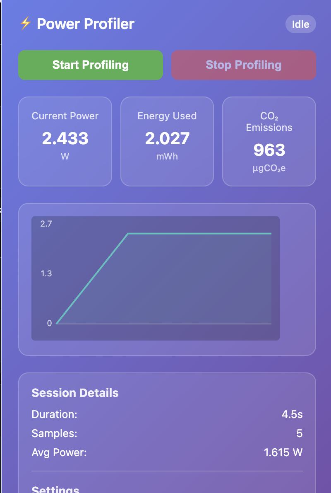

# ⚡ Emissions Profiler

A Chrome extension that monitors web page power consumption and estimates CO₂ emissions, inspired by Firefox Profiler's power tracking functionality.

## 🌟 Features

- **Real-time Power Monitoring**: Track estimated power consumption of web pages
- **CO₂ Emissions Calculation**: Estimate carbon footprint based on energy usage
- **Historical Data Visualization**: View power usage trends over time with interactive charts
- **Session Analytics**: Get detailed summaries of energy usage and emissions
- **Configurable Settings**: Adjust carbon intensity values for different regions
- **Non-invasive Monitoring**: Lightweight profiling with minimal performance impact

## 📸 Screenshots



*Popup interface showing real-time metrics and historical chart*

## 🚀 Installation

### Method 1: Load Unpacked (Development)

1. Clone or download this repository
2. Open Chrome and navigate to `chrome://extensions/`
3. Enable **Developer mode** (toggle in top-right corner)
4. Click **Load unpacked**
5. Select the `emissions-profiler` folder
6. The extension icon will appear in your toolbar

### Method 2: Chrome Web Store

*(Coming soon)*

## 🛠️ How It Works

### Power Estimation Model

The extension uses a heuristic-based approach to estimate power consumption:
```sh
Total Power = Base Power + CPU Power + Memory Power + Network Power
```

Where:
- **Base Power**: 1W (idle state)
- **CPU Power**: 2W per 100% CPU usage
- **Memory Power**: 0.01W per MB of JavaScript heap usage
- **Network Power**: 0.05W per resource request

### CO₂ Emissions Calculation

CO₂ emissions are calculated using the formula:


Default carbon intensity: **475 gCO₂e/kWh** (world average)

## 📊 Metrics Collected

### System Metrics
- CPU usage and processor information
- System memory usage
- JavaScript heap memory usage

### Performance Metrics
- Page load timings
- Resource loading metrics (size, duration)
- Frame rate and animation performance

### Energy Metrics
- Instantaneous power consumption (W, mW, µW)
- Cumulative energy usage (Wh, mWh, µWh)
- Estimated CO₂ emissions (gCO₂e, mgCO₂e)

## 🎯 Usage

### Starting a Profiling Session

1. Click the extension icon in your Chrome toolbar
2. Click **Start Profiling** to begin monitoring
3. Browse websites normally - the extension collects data in the background
4. Click **Stop Profiling** to end the session and view summary

### Understanding the Metrics

- **Current Power**: Real-time estimated power consumption
- **Energy Used**: Total energy consumed during the session
- **CO₂ Emissions**: Estimated carbon footprint
- **Average Power**: Mean power consumption over the session
- **Duration**: Total profiling time

### Adjusting Settings

1. Click the extension icon
2. Scroll to the **Settings** section
3. Adjust **CO₂ Intensity** value for your region:
   - Clean grid: 50-100 g/kWh
   - Average grid: 400-500 g/kWh
   - Coal-heavy grid: 800-1000 g/kWh
4. Click **Save** to apply changes

## 📁 Project Structure
```sh
emissions-profiler/
├── manifest.json              # Extension configuration
├── background.js              # Service worker (main logic)
├── content.js                 # Page monitoring script
├── icons/                     # Extension icons
│   ├── icon16.png
│   ├── icon48.png
│   └── icon128.png
└── popup/                     # Popup interface
    ├── popup.html            # Popup HTML
    ├── popup.js              # Popup JavaScript
    └── popup.css             # Popup styles
```

## 🔧 Technical Implementation

### Background Script (`background.js`)
- Manages profiling sessions
- Collects system metrics via Chrome APIs
- Calculates power estimates and CO₂ emissions
- Stores historical data

### Content Script (`content.js`)
- Monitors page performance metrics
- Tracks resource loading
- Measures JavaScript memory usage
- Communicates with background script

### Popup Interface (`popup/`)
- Real-time metric display
- Interactive chart visualization
- Session controls and settings

## 📋 Permissions

The extension requires the following permissions:

- **`activeTab`**: To monitor the current tab
- **`storage`**: To save settings and session data
- **`scripting`**: To inject content scripts
- **`system.cpu`**: To access CPU usage information
- **`system.memory`**: To access memory usage information
- **`<all_urls>`**: To monitor all visited websites

## ⚠️ Limitations & Accuracy

### Current Limitations
1. **Estimation-based**: Uses heuristics rather than direct hardware measurements
2. **Browser-only**: Doesn't account for server-side energy usage
3. **Simplified model**: Power estimation coefficients are approximate
4. **Regional averages**: Uses default carbon intensity values

### Accuracy Notes
- Power estimates are **indicative** rather than absolute
- Best used for **comparative analysis** between websites
- Most accurate for **identifying optimization opportunities**
- Values are **calibrated for typical desktop usage**

## 🔮 Future Enhancements

Planned features:

1. **Export functionality** for data analysis
2. **Benchmarking** against similar websites
3. **Machine learning** models for improved accuracy
4. **Detailed reports** with optimization suggestions
5. **Integration** with Chrome DevTools
6. **Team collaboration** features
7. **API** for programmatic access to metrics

## 📚 Learning Resources

### Power Estimation References
- [The Green Web Foundation CO2.js](https://www.thegreenwebfoundation.org/co2-js/)
- [Sustainable Web Design Model](https://sustainablewebdesign.org/)
- [Chrome Energy Saver Mode](https://developer.chrome.com/blog/energy-saver-mode/)

### Carbon Intensity Data
- [Electricity Maps](https://www.electricitymaps.com/)
- [IEA Global Energy Review](https://www.iea.org/reports/global-energy-review-2021)
- [UNFCCC Greenhouse Gas Inventory Data](https://unfccc.int/ghg-inventories-annex-i-parties/2021)

## 🤝 Contributing

Contributions are welcome! Here's how you can help:

1. Fork the repository
2. Create a feature branch (`git checkout -b feature/improvement`)
3. Commit your changes (`git commit -m 'Add some improvement'`)
4. Push to the branch (`git push origin feature/improvement`)
5. Open a Pull Request

### Areas Needing Contribution
- Improved power estimation algorithms
- Additional metric collection
- UI/UX improvements
- Documentation
- Testing and validation

## 📄 License

This project is licensed under the Mozilla Public License 2.0 - see the LICENSE file for details.

## 🐛 Issues & Support

Found a bug or need help?

1. Check the Issues page
2. Create a new issue with:
   - Description of the problem
   - Steps to reproduce
   - Screenshots if applicable
   - Chrome version and OS information

## 🙏 Acknowledgments

- Inspired by **Firefox Profiler** power tracking features
- Uses concepts from **The Green Web Foundation's CO2.js**
- Built with guidance from **Chrome Extensions documentation**
- Chart visualization powered by **Chart.js**

## 📈 Why Monitor Power Usage?

### For Developers
- Identify performance bottlenecks
- Optimize for energy efficiency
- Reduce hosting costs
- Improve user experience on battery-powered devices

### For Sustainability
- Reduce digital carbon footprint
- Meet ESG (Environmental, Social, Governance) goals
- Contribute to climate action
- Promote sustainable web development practices

---

**Made with ❤️ for a greener web**